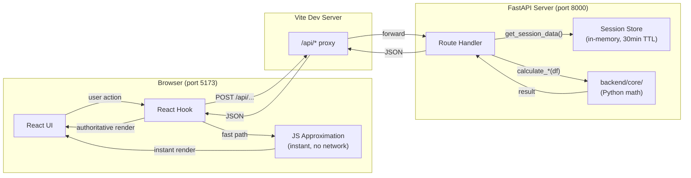
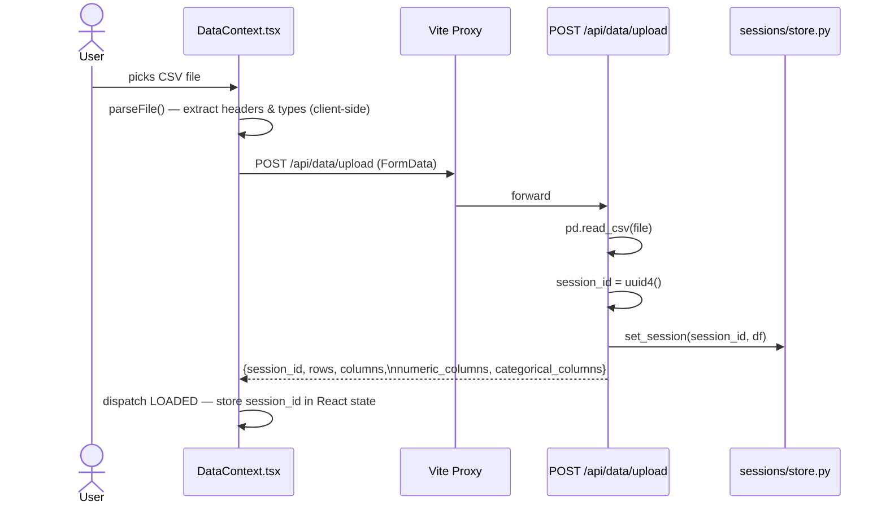
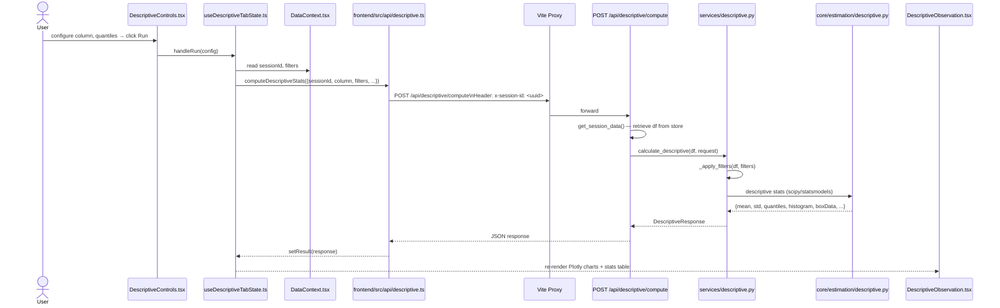
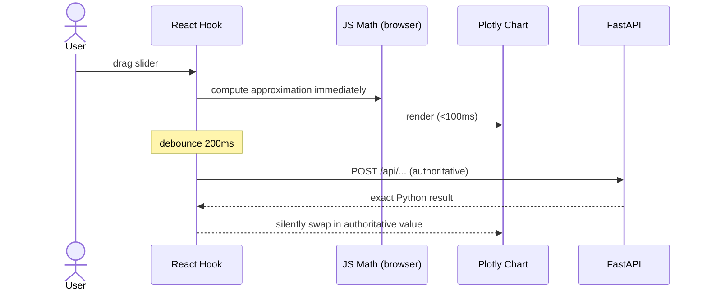
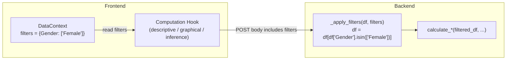
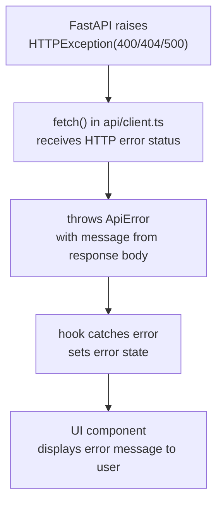

# Frontend ↔ Backend Interaction

This document explains how `frontend/` and `backend/` communicate — from a user action in the browser all the way to Python computation and back.

---

## 1. The Big Picture



Two separate servers run simultaneously during development:

| Server | Command | Port | Role |
|--------|---------|------|------|
| Vite (React) | `npm run dev` in `frontend/` | 5173 | Serves the browser app |
| Uvicorn (FastAPI) | `uvicorn main:app` in `backend/` | 8000 | Runs all Python math |

The Vite dev server **proxies** every request whose path starts with `/api` to port 8000 (configured in [frontend/vite.config.ts](../frontend/vite.config.ts)):

```typescript
proxy: {
  '/api': { target: 'http://localhost:8000', changeOrigin: true }
}
```

So from React's perspective, it always talks to itself — but `/api/*` requests silently land on FastAPI.

---

## 2. Session: How the Backend Knows Whose Data It Has

There is no login. Instead, a **session ID** (UUID) ties a user to their uploaded dataset.

### Upload flow



Every subsequent API call sends this `session_id` in two places:
- **Request body** field `session_id`
- **HTTP header** `x-session-id`

The backend's shared dependency function ([backend/api/deps.py](../backend/api/deps.py)) reads the header and retrieves the DataFrame:

```python
async def get_session_data(x_session_id: str | None = Header(None)) -> pd.DataFrame:
    df = store.get_session(x_session_id)   # returns None if expired
    if df is None:
        raise HTTPException(404, "Session not found or expired")
    return df
```

FastAPI injects this into every route that needs data:

```python
@router.post("/compute")
def compute_descriptive(request: DescriptiveRequest,
                        df: pd.DataFrame = Depends(get_session_data)):
    ...
```

### Session lifetime

Stored in a plain Python dict in [backend/sessions/store.py](../backend/sessions/store.py):
- TTL: **30 minutes** from last access
- Cleanup: background task runs every **5 minutes** to evict expired entries
- No persistence — server restart clears all sessions

---

## 3. The API Endpoints

All endpoints live under `/api/`. The CORS policy in [backend/main.py](../backend/main.py) allows requests from `http://localhost:5173` only.

| Endpoint | Method | Auth needed | What it does |
|----------|--------|-------------|--------------|
| `/api/health` | GET | No | Liveness check |
| `/api/data/upload` | POST | No | Upload CSV, get session_id |
| `/api/descriptive/compute` | POST | `x-session-id` | Run descriptive statistics |
| `/api/graphical/compute` | POST | `x-session-id` | Build histogram / ECDF / PMF |
| `/api/inference/estimators` | POST | `x-session-id` | List available estimators for a column |
| `/api/inference/ci` | POST | `x-session-id` | Compute confidence intervals |
| `/api/inference/pi` | POST | `x-session-id` | Compute prediction intervals |
| `/api/inference/regions` | POST | `x-session-id` | Compute confidence regions |

---

## 4. Worked Example: Descriptive Statistics

This is the most complete feature — tracing it end-to-end shows the full pattern.



---

## 5. Two Modes of Computation

Not everything goes to the backend. The project uses two modes depending on what is needed:

| Mode | Where | Used for | Why |
|------|-------|----------|-----|
| **JS approximation** | Browser (TypeScript) | Probability distributions (PDF/PMF/CDF), Normal curve, CI shading | Instant response while slider is moving |
| **Python authoritative** | FastAPI (Python/scipy) | Descriptive stats, graphical analysis, inference, regression | Exact math using scipy/statsmodels/pingouin |

For slider-driven features, both modes run in sequence:



This makes the app feel instant while ensuring the numbers are always correct.

---

## 6. Filter System

The user can narrow the dataset to a subset (e.g., "only Female respondents") using the filter panel in the Data tab. These filters live in `DataContext` as:

```typescript
filters: Record<string, string[]>
// e.g. { "Gender": ["Female"], "Department": ["Engineering", "Science"] }
```

Every computation hook reads `filters` from the context and includes it in the request body. The backend applies the filters to the DataFrame before any calculation:



---

## 7. Error Handling

Errors flow back the same path as successful results:



Standard HTTP status codes used:
- `400` — bad request (invalid column, missing parameter)
- `404` — session not found or expired
- `500` — unexpected Python exception

---

## 8. File Map

| What you want to understand | File(s) to read |
|-----------------------------|-----------------|
| How proxy works in dev | `frontend/vite.config.ts` |
| All fetch calls + TypeScript types | `frontend/src/api/` |
| How a feature hook orchestrates API | `frontend/src/hooks/use*TabState.ts` |
| Global session ID + filters state | `frontend/src/context/DataContext.tsx` |
| All FastAPI route definitions | `backend/api/routes/` |
| Request/response shapes | `backend/api/schemas/` |
| Session ID header injection | `backend/api/deps.py` |
| In-memory session store + TTL | `backend/sessions/store.py` |
| CORS config, route mounting | `backend/main.py` |
| Pure math (professor verifies) | `backend/core/` |
